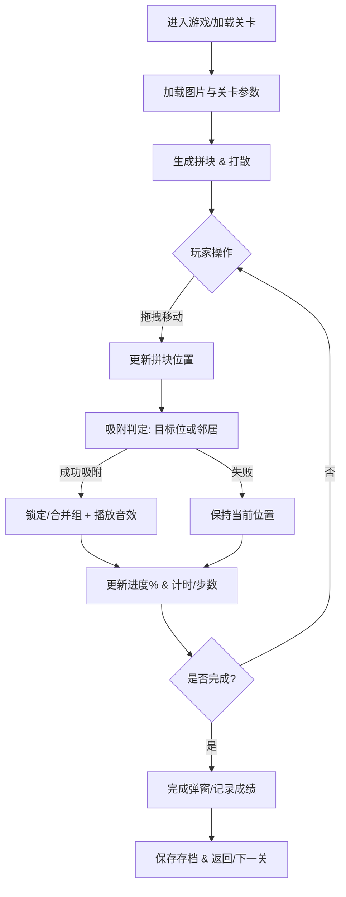
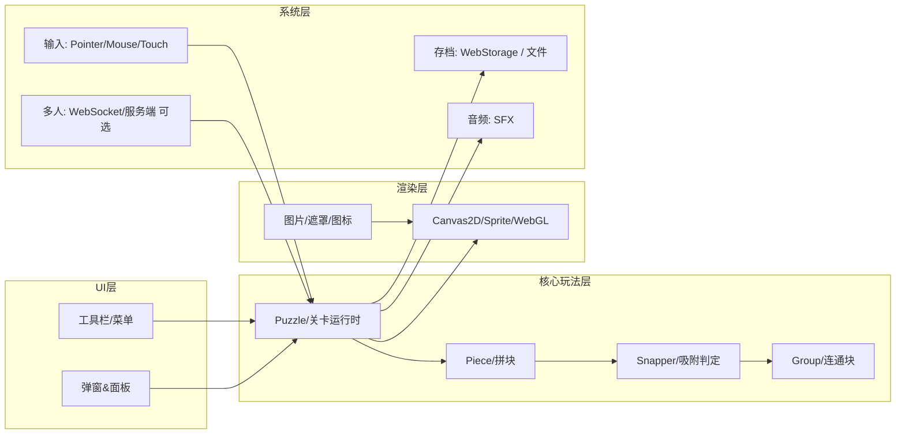

# 从 0 到 1 开发拼图游戏：基于附件 jigex-prog.js 的逻辑拆解与 Unity/HTML5/Godot 复现路线图

## 未指定项与默认假设

你在需求里明确要求“从 0 到 1 复刻附件中拼图游戏的全部逻辑与功能”，但同时指出“附件内容未提供”。在本对话中我实际收到了一个附件文件 **jigex-prog.js**，其文件头部包含明确的版权与禁止复制/再分发声明。fileciteturn0file0 同时，Jigsaw Explorer 的条款也明确禁止复制、修改、反编译/逆向工程或制作衍生作品。citeturn12view0  
因此：**我不能**按“逐行逆向 + 1:1 克隆原产品”的方式指导你复刻；但我可以在**不复制其代码/资源**、不提供“绕过限制/防护”的前提下，基于附件暴露出的“可见功能与通用做法”，教你做一款**玩法与体验高度相似**（功能等价、架构可比、用户感受接近）的拼图游戏，并给出三套引擎的可运行最小示例与完整工程化路线。

下表列出你未指定的关键项，并给出常见选项与本文默认推荐（你可把它当做“课程设定”）：

| 项目 | 你是否指定 | 常见可行选项 | 本文默认/推荐 | 选择理由 |
|---|---:|---|---|---|
| 游戏类型 | 未明确 | ① 传统拼图（拖拽拼块、互相吸附）② 滑块拼图（15-puzzle） | **传统拼图（拖拽+吸附+可旋转）** | 附件与 Jigsaw Explorer 功能说明对应“传统拼图平台”（拖拽、旋转、多人协作等）。citeturn9view0turn10view0 |
| 目标平台 | 未指定 | Web、PC 桌面、移动端、跨平台 | **Web 优先**（同时给 Unity/Godot 跨平台路线） | 原平台是网页拼图；Web 成本低、迭代快。citeturn17view0turn14search1 |
| 引擎/技术栈 | 未指定 | Unity(C#)、HTML5+JS(Canvas/WebGL)、Godot(GDScript) | **三套都覆盖**：HTML5(主讲) + Unity/Godot(对照实现) | 你要求至少覆盖三套；同时 Web 与原平台最贴近。citeturn14search1turn13search4turn16search3 |
| 图形渲染 | 未指定 | Canvas2D、WebGL、引擎2D渲染 | **MVP 用 2D（Canvas/2D Sprite）**；进阶可上 WebGL/Shader | 先做可玩，再做质感（阴影/倒角/遮罩命中）。citeturn14search0turn14search1 |
| 拼块形状 | 未指定 | 矩形网格裁切、贝塞尔曲线拼图齿形 | **两阶段**：MVP 矩形网格；进阶齿形（贝塞尔/遮罩） | 初学者先跑通交互/吸附；再升级真实齿形。贝塞尔曲线可作为齿形基础。citeturn15search10turn15search1 |
| 是否含旋转 | 未指定 | 无旋转 / 90°旋转 / 任意角旋转 | **90°旋转（可开关）** | Jigsaw Explorer 支持旋转并提供滚轮/方向键旋转说明。citeturn9view0 |
| 是否含“边缘块模式” | 未指定 | 无 / 仅显示边缘块 / 边缘块整理 | **做成可选功能** | Jigsaw Explorer 提到“Display edge pieces only”并在多人模式下有特殊行为。citeturn10view0 |
| 是否含“盒盖预览/神秘模式” | 未指定 | 无 / 预览图 / 神秘（禁预览、禁提前看信息） | **做成可选功能** | Jigsaw Explorer 支持“mystery puzzle”，会禁用预览并隐藏 credit 等。citeturn11view0turn4view0 |
| 存档方式 | 未指定 | Web：localStorage/IndexedDB；引擎：文件/云端 | **本地存档**：Web Storage；Unity persistentDataPath；Godot user:// | Jigsaw Explorer 会在浏览器存储中自动保存进度；Web Storage 是标准方案。citeturn9view0turn18search2turn18search1turn18search3 |
| 联网/多人 | 未指定 | 单机离线 / 可选多人（WebSocket/服务端） | **先单机离线，后作为扩展加入多人** | 多人需要服务端与同步协议；Jigsaw Explorer 也说明多人依赖 WebSocket。citeturn10view0 |
| 变现 | 未指定 | 无、广告、内购 | **默认无变现** | 学习与复现优先；变现会引入政策/SDK/合规成本。 |

## Executive summary（执行摘要）

这份报告把“做一款与附件拼图**体验高度相似**的游戏”拆成两条主线：  

第一条主线是**功能规格（What）**：从公开页面与附件可推断的用户可见功能包括：拖拽拼块、拼块吸附合并（形成可整体拖动的连通块）、可选旋转、边缘块模式、盒盖/预览图、神秘模式（禁预览/禁提前降低块数）、自动保存与恢复、多人协作（可选）。其中“自动保存、旋转说明、硬件加速建议、多人规则、WebSocket 依赖、神秘模式行为”等都有官方页面描述可作为需求依据。citeturn9view0turn10view0turn11view0turn17view0  

第二条主线是**工程路线（How）**：你作为新手，最稳的方式是**分两层实现**：  
1) **MVP（1~2 周）**：矩形网格切图 + 拖拽 + 对齐吸附到目标位 + 完成判定 + 本地存档 + 基础 UI。它能立刻跑起来，适合学习“输入→拖拽→渲染→判定→存档”的闭环。MDN 的 Canvas `getContext()`/`drawImage()` 与 Pointer Events 可直接支撑 Web 版 MVP。citeturn14search1turn14search0turn0search3  
2) **进阶复现（2~6 周，取决于目标质量）**：加入“齿形拼块（贝塞尔曲线/遮罩/网格或纹理切割）+ 互相吸附合并 + 组移动 + 阴影倒角着色 + 可旋转 + 边缘块模式 + 盒盖/神秘模式 +（可选）多人协作”。贝塞尔曲线与曲线系统是生成拼图齿形的常用基础，Godot 官方教程与开源生成器都能作为可复用参考（注意各自许可证）。citeturn15search10turn15search1turn15search8  

你最终会得到：一份可执行的分阶段计划、模块/数据结构设计、存档与关卡格式、三套引擎的最小可运行核心代码（生成、拖放、对齐判定、关卡加载），以及流程图/模块图/时序图/UI 草图（Mermaid 可直接渲染）。

## 附件程序的要点拆解（安全合规版）

### 合规边界说明
- 附件头部的版权声明明确限制复制、再分发与未经授权使用。fileciteturn0file0  
- 官方条款明确禁止复制、修改、反编译/逆向工程或制作衍生作品。citeturn12view0  

所以本节只做“**架构与玩法层面的理解**”，把它转译成你可以自己实现的**通用设计模式**，不提供“照抄实现细节/绕过限制”的方法。

### 从公开信息可确认的“用户可见特性”
这些点你可以直接写进你的需求文档（因为它们来自官方说明，而不是逆向猜测）：

- **自动保存进度**：Jigsaw Explorer 表示会把未完成进度自动保存在浏览器的 cookie 存储中；隐私模式可能无法保存；多人模式则把进度保存在服务器并可跨设备继续（但要保留游戏链接）。citeturn9view0turn10view0  
- **旋转功能**：若启用旋转，需要用滚轮或键盘左右键旋转拼块；可在菜单 “Modify this puzzle” 中关闭旋转。citeturn9view0  
- **全屏与性能注意**：官方提示拼图没有缩放功能（计划中），建议用系统放大镜；并指出若移动拖拽卡顿可以尝试启用浏览器硬件加速。citeturn9view0  
- **多人协作**：支持多人共同拼同一张图；每个玩家都能看到他人操作；同时在线最多 20 人；进度可保存，但链接 30 天不活动会过期/被清理；并明确多人依赖 WebSocket（某些企业/校园网络可能不支持）。citeturn10view0  
- **边缘块模式按钮行为**：多人加入后，“仅显示边缘块”按钮可能会被改成“Rearrange”以避免影响他人。citeturn10view0  
- **神秘模式（Mystery puzzle / Escape room）**：神秘模式会禁用预览图（box top/preview），完成前也隐藏 credit line，且玩家不能通过减少拼块数快速看到图像内容。citeturn11view0turn4view0  
- **自定义拼图的图片来源**：Jigsaw Explorer 说明不会存储你提供的图片，加载时从你给的 URL 拉取图片。citeturn17view0  

### 从附件可归纳的“通用实现模式”（不抄代码可复刻）
结合你提供的 `jigex-prog.js`（它看起来是一个网页拼图平台的主程序/模块加载器与核心逻辑集合）可以抽象出这些“行业通用模块”，你实现自己的版本时可以按这个分层来做：fileciteturn0file0  

1) **输入层（Input）**：统一鼠标/触摸/触控笔输入的“按下、移动、抬起”，并提供“捕获当前拖拽目标”的机制。Web 上可以用 Pointer Events 统一不同输入设备。citeturn0search3  

2) **渲染层（Renderer）**：  
- MVP：2D（Canvas2D 或引擎 Sprite/UI）即可；Canvas 通过 `getContext("2d")` 获取上下文，`drawImage` 支持从源图裁切绘制到画布。citeturn14search1turn14search0  
- 进阶：WebGL/Shader 可做倒角、阴影、遮罩命中检测、批量绘制等（这是高性能“大量拼块”的关键原因之一；官方也建议硬件加速）。citeturn9view0  

3) **玩法实体层（Domain）**：核心通常是三类对象：  
- `Piece`（拼块）：位置、角度、是否已锁定/是否在组里、与邻居的拓扑关系。  
- `Group`（连通块/拼块组）：由已连接的拼块组成，拖动/旋转时整体变换。  
- `Puzzle`（关卡实例）：图像、切分参数（行列数）、进度、计时、规则开关（旋转、神秘、边缘块等）。  

4) **吸附与合并（Snap & Merge）**：  
- MVP：拼块拖到“目标位置”就吸附锁定。  
- 进阶：拼块靠近其邻居时，按“**相对位移误差**”阈值判定是否吸附；吸附后合并为组；完成条件是组大小等于总拼块数。  

5) **存档与恢复（Save/Load）**：  
Web 可用 Web Storage（localStorage/sessionStorage）按 key/value 保存 JSON；这类存储不会随请求发送到服务器，且 localStorage 可跨浏览器重启保留。citeturn18search2  
引擎侧可用 Unity `Application.persistentDataPath` 或 Godot `user://` 路径保存 JSON/二进制。citeturn18search1turn18search3  

6) **多人同步（可选）**：多人拼图本质是“状态同步/事件同步”，官方明确需要 WebSocket 一类实时通道。citeturn10view0  

## 可替代的完整游戏规格（假设性重构）

本节给出一份**你可以直接照着开发**的“完整规格说明书（Game Design + Tech Spec）”。  
为避免误导，我用 ✅/⚠️ 标注来源性质：  
- ✅：来自官方功能说明（可靠）  
- ⚠️：根据典型拼图产品与附件结构推断的实现建议（你可调整）

### 关卡与规则

**关卡数据（Level）**（✅+⚠️）  
- `image`：拼图原图（URL 或本地资源）。官方自定义拼图即通过 URL 拉图。citeturn17view0  
- `pieces`：初始块数（默认 100；用户可改）。citeturn4view0  
- `backgroundColor`：背景色（官方创建页提供）。citeturn4view0  
- `rotateEnabled`：是否启用旋转（官方支持）。citeturn9view0  
- `mystery`：神秘模式开关（官方支持）。citeturn11view0  
- `edgeOnlyMode`：仅显示边缘块/整理边缘块（官方按钮行为可参考）。citeturn10view0  

**胜利条件（✅+⚠️）**  
- 全部拼块都已在正确组装状态：  
  - MVP：所有拼块锁定到目标格位即完成。  
  - 进阶：存在一个 `Group` 的成员数等于总拼块数即完成（更贴近“拼块互相吸附”的体验）。⚠️  

**操作规则（✅）**  
- 拖拽：按下拼块→移动→松开。  
- 旋转：启用旋转后用滚轮或键盘左右键把拼块以 90°步进旋转；也可在菜单关闭旋转。citeturn9view0  

### UI/UX 需求清单

建议你把 UI 拆成 3 层（⚠️）：
- 顶部工具栏：菜单、边缘块、盒盖预览、旋转开关、全屏、多人（可选）、计时器。  
- 中央画布：拼图背景与拼块。  
- 弹窗与面板：帮助、设置、加载中、完成提示、多人链接分享。  

关于全屏与嵌入尺寸：官方说明嵌入时可设置宽高、并支持全屏按钮；同时提醒不要在同一页嵌多个拼图实例，因为资源占用大（尤其手机）。citeturn17view0  

### 存档规格（可直接实现）

**Web 存档（✅+⚠️）**  
- 使用 `localStorage` 保存 JSON（key = `puzzle:<levelId>`）。Web Storage 的机制与访问方式见 MDN。citeturn18search2  
- 保存字段建议：  
  - `levelId`, `imageHash`, `rows`, `cols`, `rotateEnabled`, `mystery`  
  - `elapsedSeconds`, `completed`  
  - `pieces[]`: `id`, `xNorm`, `yNorm`, `angle`, `groupId`, `locked`  

**Unity 存档（✅+⚠️）**  
- 推荐保存到 `Application.persistentDataPath` 下（跨平台可用，更新不会清空）。citeturn18search1  

**Godot 存档（✅+⚠️）**  
- 推荐保存到 `user://`，用 `FileAccess` 读写字符串/JSON。citeturn18search3  

### 多人模式规格（可选扩展）

根据官方说明：多人需要实时通道（WebSocket），并用“分享链接”作为房间入口；游戏在 30 天不活动后会清理；最大同时 20 人。citeturn10view0  
你可做一个“教学版”多人协议（⚠️）：  
- 房间：`roomId`  
- 事件：`selectPiece(pieceId)`, `moveGroup(groupId, xNorm, yNorm)`, `rotateGroup(groupId, angleStep)`, `joinPieces(a,b)`  
- 同步策略：优先事件流（Event Sourcing），加上定期快照（Snapshot）以便断线重连。

## 分阶段开发计划与里程碑

下面计划以“新手可落地”为目标，时间是**粗估**（取决于你每天投入小时数与是否已有美术资源）。如果你只想尽快做出可玩版，优先走“HTML5 MVP → 再择一引擎迁移”。

### 阶段一：需求与原型（1–2 天）

| 里程碑 | 任务清单 | 产出物 | 需要技能 |
|---|---|---|---|
| 需求冻结 v0 | 明确：平台、是否旋转、是否神秘、默认块数、UI按钮清单、存档策略 | 需求文档（本报告第“规格”可直接拷贝） | 产品拆解、写清楚状态与边界条件 |
| 交互原型 | 用 Figma/纸面画 UI 草图；写 5 条核心玩家路径（开始→拖拽→吸附→完成→保存/恢复） | UI 草图 + 用户流程 | 基础交互设计 |

**可视化：玩家主流程（Mermaid）**



### 阶段二：核心玩法实现（3–7 天，MVP）

| 里程碑 | 任务清单 | 估时 | 示例关键点 |
|---|---|---:|---|
| 拼图生成（矩形网格） | 图片加载、按行列裁切、生成 piece 数据、随机打散 | 1–2 天 | Web 用 `drawImage` 的 9 参数裁切绘制；citeturn14search0 |
| 拖拽系统 | 指针按下选中、移动、抬起 | 1–2 天 | Web 用 Pointer Events 统一鼠标/触摸；citeturn0search3 Unity UI 可实现 `IDragHandler` 等接口；citeturn13search4 Godot 用 `_input` + InputEventScreenDrag；citeturn13search3 |
| 对齐判定（先对目标位） | 松手后若距离目标 < 阈值则吸附并锁定 | 0.5–1 天 | 先做“目标位吸附”，再升级“邻居吸附+分组” |
| 完成判定与计时 | 计算已锁定数量或组装完成 | 0.5 天 | 完成后弹窗、音效 |
| 基础 UI | 开始/重开/提示、当前进度%、计时 | 1 天 | 工具栏结构见官方功能点。citeturn9view0turn17view0 |

### 阶段三：关卡与资源制作（2–5 天）

| 里程碑 | 任务清单 | 估时 | 资源清单建议 |
|---|---|---:|---|
| 关卡格式 | 设计 JSON：image、rows/cols、背景色、旋转、神秘等 | 0.5 天 | 见下文“关卡格式示例” |
| 美术资源 | 主题图、按钮图标、提示图 | 1–3 天 | 图标：菜单/旋转/边缘/盒盖/全屏/音量 |
| 音效 | snap、click、rotate、complete | 0.5–1 天 | 注意移动端/浏览器需要用户交互后才可播放音频（Safari 特别常见）。官方也在支持文档里提示与浏览器自动播放相关。citeturn9view0 |

### 阶段四：UI/UX 与动画（2–6 天）

重点做“体验像”：  
- 拼块抬起时置顶、吸附时“轻微回弹/闪光”、完成时庆祝动画。⚠️  
- 全屏与嵌入尺寸自适应：官方强调可设置宽高与 full-screen，且不建议一页多实例以免资源压力。citeturn17view0  

### 阶段五：音效与本地化（1–3 天）

- 音效开关（muted）、音量设置；Web 存 `localStorage`。citeturn18search2  
- 文案本地化：至少 zh-CN；可用 JSON 字典或引擎本地化系统。⚠️  

### 阶段六：测试与发布（2–7 天）

- Web：跨浏览器测试（Chrome/Edge/Firefox/Safari）。Godot 官方也提醒 Web 导出在 Safari 上可能存在 WebGL2 问题并建议优先 Chromium/Firefox。citeturn16search0  
- Unity：按 Build Settings 构建并选择目标平台（含 WebGL）。citeturn16search2turn16search1  
- Godot：配置导出预设并导出项目；Web 导出另有专门说明。citeturn16search3turn16search0  

### 阶段七：后期维护（持续）

- 性能：高块数优化（批渲染、空间索引、只重绘脏区域等）。⚠️  
- 玩法扩展：提示系统、自动整理、排行榜、每日挑战。⚠️  
- 多人（可选）：服务端、房间与同步、断线重连、冲突解决。官方多人玩法依赖 WebSocket，是一个独立大项目。citeturn10view0  

## 架构与数据结构设计（含存档/关卡格式）

### 模块关系图（Mermaid）



### 核心数据结构表

| 名称 | 关键字段 | 说明 |
|---|---|---|
| `LevelSpec` | `levelId`, `imageUrl|imageKey`, `rows`, `cols`, `bgColor`, `rotateEnabled`, `mystery` | 关卡配置（可序列化） |
| `PieceState` | `id`, `row`, `col`, `srcRect`, `pos`, `angle`, `locked`, `groupId` | 拼块运行时状态 |
| `GroupState` | `id`, `memberIds[]`, `pivotId` | 连通块/可整体拖动对象 |
| `PuzzleState` | `elapsedSec`, `moves`, `completed`, `pieces[]`, `groups[]` | 可存档的整体状态 |
| `SnapRule` | `targetSnapPx`, `neighborSnapPx`, `angleStrict` | 吸附阈值与规则开关 |

### 关卡格式示例（JSON）

```json
{
  "levelId": "demo-001",
  "image": { "type": "url", "value": "https://example.com/my-photo.jpg" },
  "grid": { "rows": 6, "cols": 10 },
  "bgColor": "#7390aa",
  "rotateEnabled": true,
  "mystery": false,
  "edgeOnlyMode": true
}
```

说明：  
- 你若走“自定义图片 URL”路线，需要处理跨域与 CORS（否则 Canvas 读像素或导出会受限）；原平台也强调图片通过 URL 拉取。citeturn17view0turn14search0  

### 存档格式示例（JSON）

```json
{
  "ver": 1,
  "levelId": "demo-001",
  "savedAt": 1760000000000,
  "elapsedSec": 523,
  "moves": 128,
  "completed": false,
  "rotateEnabled": true,
  "pieces": [
    { "id": 1, "xNorm": 0.12, "yNorm": 0.83, "angle": 90, "locked": false, "groupId": 7 },
    { "id": 2, "xNorm": 0.15, "yNorm": 0.84, "angle": 90, "locked": false, "groupId": 7 }
  ],
  "groups": [
    { "id": 7, "memberIds": [1,2], "pivotId": 1 }
  ]
}
```

Web 存储建议：  
- `localStorage.setItem(key, JSON.stringify(save))`，并处理版本升级。Web Storage 的基本机制见 MDN。citeturn18search2  

## 最小可运行核心示例代码（Unity/HTML5/Godot）

说明：以下示例是“教学用最小闭环”，包含你要求的四件事：**拼图生成、拖放、对齐判定、关卡加载**。  
- 为了让初学者能跑通，我在 MVP 里使用 **矩形网格拼块**（不是齿形）。  
- 当你跑通后，再按上一节的进阶路线替换为“齿形 + 邻居吸附 + 分组移动”。（可把它当作“第 2 学期内容”）

### Unity（C#，UGUI 版：Canvas + Image 拖拽）

关键依赖：Unity UI 事件接口 `IPointerDownHandler`、`IDragHandler` 等。citeturn13search5turn13search4  

**PuzzleBootstrap.cs（挂到空物体，负责加载图片、生成拼块）**
```csharp
using System;
using System.Collections.Generic;
using UnityEngine;
using UnityEngine.Networking;
using UnityEngine.UI;

public class PuzzleBootstrap : MonoBehaviour
{
    [Header("UI Refs")]
    public RectTransform boardRoot;     // 拼图区域父节点（RectTransform）
    public RectTransform piecesRoot;    // 拼块散落区父节点
    public GameObject piecePrefab;      // 预制体：Image + PuzzlePieceUI

    [Header("Level")]
    public string imageUrl = "https://picsum.photos/1024/768";
    public int rows = 4;
    public int cols = 6;
    public float scatterPadding = 40f;
    public float snapThreshold = 25f;   // 像素阈值：离目标多近就吸附

    private Texture2D _tex;
    private readonly List<PuzzlePieceUI> _pieces = new();

    async void Start()
    {
        // 1) 加载关卡图片（URL 或本地）
        _tex = await LoadTexture(imageUrl);
        if (_tex == null)
        {
            Debug.LogError("Failed to load image.");
            return;
        }

        // 2) 生成拼块（矩形裁切）
        GeneratePieces(_tex, rows, cols);
    }

    private async System.Threading.Tasks.Task<Texture2D> LoadTexture(string url)
    {
        using var req = UnityWebRequestTexture.GetTexture(url);
        var op = req.SendWebRequest();
        while (!op.isDone) await System.Threading.Tasks.Task.Yield();

        if (req.result != UnityWebRequest.Result.Success) return null;
        return DownloadHandlerTexture.GetContent(req);
    }

    private void GeneratePieces(Texture2D tex, int r, int c)
    {
        float boardW = boardRoot.rect.width;
        float boardH = boardRoot.rect.height;

        int pieceW = tex.width / c;
        int pieceH = tex.height / r;

        for (int row = 0; row < r; row++)
        for (int col = 0; col < c; col++)
        {
            // 生成 Sprite（裁切原图）
            var rect = new Rect(col * pieceW, tex.height - (row + 1) * pieceH, pieceW, pieceH);
            var sprite = Sprite.Create(tex, rect, new Vector2(0.5f, 0.5f), 100f);

            var go = Instantiate(piecePrefab, piecesRoot);
            var img = go.GetComponent<Image>();
            img.sprite = sprite;

            var piece = go.GetComponent<PuzzlePieceUI>();
            piece.id = row * c + col;
            piece.snapThreshold = snapThreshold;

            // 目标位置：把棋盘区域当作“正确拼好”的位置
            Vector2 target = GridToBoardAnchoredPos(boardRoot, row, col, r, c);
            piece.targetAnchoredPos = target;

            // 初始位置：随机散落
            var rand = new Vector2(
                UnityEngine.Random.Range(-boardW/2 + scatterPadding, boardW/2 - scatterPadding),
                UnityEngine.Random.Range(-boardH/2 + scatterPadding, boardH/2 - scatterPadding)
            );
            (go.transform as RectTransform)!.anchoredPosition = rand;

            _pieces.Add(piece);
        }
    }

    private Vector2 GridToBoardAnchoredPos(RectTransform board, int row, int col, int rows, int cols)
    {
        // 让拼块最终拼在 boardRoot 中心区域形成网格
        float w = board.rect.width;
        float h = board.rect.height;
        float cellW = w / cols;
        float cellH = h / rows;

        float x = -w/2 + cellW * (col + 0.5f);
        float y =  h/2 - cellH * (row + 0.5f);
        return new Vector2(x, y);
    }
}
```

**PuzzlePieceUI.cs（挂到拼块预制体：处理拖拽与吸附）**
```csharp
using UnityEngine;
using UnityEngine.EventSystems;

[RequireComponent(typeof(RectTransform))]
public class PuzzlePieceUI : MonoBehaviour, IPointerDownHandler, IDragHandler, IPointerUpHandler
{
    public int id;
    public float snapThreshold = 25f;
    public Vector2 targetAnchoredPos;

    private RectTransform _rt;
    private bool _locked;
    private Vector2 _pointerOffset;

    void Awake() => _rt = GetComponent<RectTransform>();

    public void OnPointerDown(PointerEventData eventData)
    {
        if (_locked) return;

        // 置顶以便显示在最上层
        transform.SetAsLastSibling();

        // 记录指针到物体的偏移，拖动更跟手
        RectTransformUtility.ScreenPointToLocalPointInRectangle(
            _rt, eventData.position, eventData.pressEventCamera, out var localPoint);
        _pointerOffset = _rt.anchoredPosition - localPoint;
    }

    public void OnDrag(PointerEventData eventData)
    {
        if (_locked) return;

        RectTransformUtility.ScreenPointToLocalPointInRectangle(
            _rt.parent as RectTransform, eventData.position, eventData.pressEventCamera, out var localPoint);
        _rt.anchoredPosition = localPoint + _pointerOffset;
    }

    public void OnPointerUp(PointerEventData eventData)
    {
        if (_locked) return;

        // 吸附到目标位置
        if (Vector2.Distance(_rt.anchoredPosition, targetAnchoredPos) <= snapThreshold)
        {
            _rt.anchoredPosition = targetAnchoredPos;
            _locked = true;
        }
    }
}
```

### HTML5 + JavaScript（Canvas2D + Pointer Events）

关键依赖：  
- 指针输入统一：Pointer Events。citeturn0search3  
- Canvas 2D：`getContext("2d")` 获取上下文；citeturn14search1  
- `drawImage` 支持“从源图裁切并绘制到画布”的 9 参数形式，是做拼块裁切渲染的核心。citeturn14search0  

**index.html（最小页面）**
```html
<canvas id="cv" width="960" height="600" style="border:1px solid #ccc"></canvas>
<script type="module" src="./puzzle.js"></script>
```

**puzzle.js（最小闭环）**
```js
const canvas = document.getElementById("cv");
const ctx = canvas.getContext("2d"); // MDN: getContext("2d") citeturn14search1

const level = {
  imageUrl: "https://picsum.photos/1024/768",
  rows: 4,
  cols: 6,
  snapPx: 24
};

function loadImage(url) {
  return new Promise((resolve, reject) => {
    const img = new Image();
    img.crossOrigin = "anonymous"; // 真实项目需处理 CORS
    img.onload = () => resolve(img);
    img.onerror = reject;
    img.src = url;
  });
}

class Piece {
  constructor(id, sx, sy, sw, sh, tx, ty) {
    this.id = id;

    // 源图裁切矩形（source rect）
    this.sx = sx; this.sy = sy; this.sw = sw; this.sh = sh;

    // 当前绘制位置
    this.x = Math.random() * (canvas.width - sw);
    this.y = Math.random() * (canvas.height - sh);

    // 目标位置（正确拼好位置）
    this.tx = tx; this.ty = ty;

    this.locked = false;
  }

  hit(px, py) {
    return !this.locked &&
      px >= this.x && px <= this.x + this.sw &&
      py >= this.y && py <= this.y + this.sh;
  }

  trySnap() {
    const dx = this.x - this.tx;
    const dy = this.y - this.ty;
    if (Math.hypot(dx, dy) <= level.snapPx) {
      this.x = this.tx; this.y = this.ty;
      this.locked = true;
    }
  }

  draw(img) {
    // MDN: drawImage(image, sx, sy, sWidth, sHeight, dx, dy, dWidth, dHeight) citeturn14search0
    ctx.drawImage(img, this.sx, this.sy, this.sw, this.sh, this.x, this.y, this.sw, this.sh);
  }
}

let img, pieces = [];
let drag = { activeId: null, offsetX: 0, offsetY: 0, pointerId: null };

function buildPieces() {
  pieces = [];
  const sw = Math.floor(img.width / level.cols);
  const sh = Math.floor(img.height / level.rows);

  // 让目标拼好区域在画布居中
  const boardW = sw * level.cols;
  const boardH = sh * level.rows;
  const originX = Math.floor((canvas.width - boardW) / 2);
  const originY = Math.floor((canvas.height - boardH) / 2);

  let id = 0;
  for (let r = 0; r < level.rows; r++) {
    for (let c = 0; c < level.cols; c++) {
      const sx = c * sw;
      const sy = r * sh;
      const tx = originX + c * sw;
      const ty = originY + r * sh;
      pieces.push(new Piece(id++, sx, sy, sw, sh, tx, ty));
    }
  }
}

function render() {
  ctx.clearRect(0, 0, canvas.width, canvas.height);

  // 背景可用纯色或单独绘制
  ctx.fillStyle = "#7390aa";
  ctx.fillRect(0, 0, canvas.width, canvas.height);

  // 先画所有拼块
  for (const p of pieces) p.draw(img);

  requestAnimationFrame(render);
}

canvas.addEventListener("pointerdown", (e) => {
  const rect = canvas.getBoundingClientRect();
  const px = e.clientX - rect.left;
  const py = e.clientY - rect.top;

  // 从上到下命中（后画的在上层）
  for (let i = pieces.length - 1; i >= 0; i--) {
    const p = pieces[i];
    if (p.hit(px, py)) {
      drag.activeId = p.id;
      drag.pointerId = e.pointerId;
      drag.offsetX = p.x - px;
      drag.offsetY = p.y - py;

      // 置顶：把选中的 piece 移到数组末尾
      pieces.splice(i, 1);
      pieces.push(p);

      canvas.setPointerCapture(e.pointerId);
      break;
    }
  }
});

canvas.addEventListener("pointermove", (e) => {
  if (drag.activeId === null || e.pointerId !== drag.pointerId) return;

  const rect = canvas.getBoundingClientRect();
  const px = e.clientX - rect.left;
  const py = e.clientY - rect.top;

  const p = pieces.find(x => x.id === drag.activeId);
  if (!p) return;
  p.x = px + drag.offsetX;
  p.y = py + drag.offsetY;
});

canvas.addEventListener("pointerup", (e) => {
  if (drag.activeId === null || e.pointerId !== drag.pointerId) return;

  const p = pieces.find(x => x.id === drag.activeId);
  if (p) p.trySnap();

  drag.activeId = null;
  drag.pointerId = null;
});

(async function main() {
  img = await loadImage(level.imageUrl);
  buildPieces();
  render();
})();
```

### Godot（GDScript，Node2D + Sprite2D 拖拽）

输入事件参考：  
- 触摸拖拽事件 `InputEventScreenDrag`，用于移动端。citeturn13search3  
- 鼠标按键 `InputEventMouseButton`。citeturn14search2  

下面示例用 `Area2D` + `CollisionShape2D` 做最小命中（矩形），拼块用 `Sprite2D` 显示（MVP 矩形裁切可以用 `AtlasTexture` 或把图片切成小图；这里给结构代码）。

**Piece.gd（挂到 Area2D）**
```gdscript
extends Area2D

@export var id: int = 0
@export var target_pos: Vector2
@export var snap_threshold: float = 24.0

var locked := false
var dragging := false
var drag_offset := Vector2.ZERO

func _ready():
  input_pickable = true

func _input_event(viewport, event, shape_idx):
  if locked:
    return

  if event is InputEventMouseButton:
    if event.button_index == MOUSE_BUTTON_LEFT and event.pressed:
      dragging = true
      drag_offset = global_position - event.position
      z_index = 1000
    elif event.button_index == MOUSE_BUTTON_LEFT and not event.pressed and dragging:
      dragging = false
      _try_snap()

  # 触屏拖拽：InputEventScreenDrag（移动端）
  if event is InputEventScreenDrag:
    dragging = true
    global_position = event.position + drag_offset

func _process(_delta):
  if locked:
    return
  if dragging and Input.is_mouse_button_pressed(MOUSE_BUTTON_LEFT):
    global_position = get_global_mouse_position() + drag_offset

func _try_snap():
  if global_position.distance_to(target_pos) <= snap_threshold:
    global_position = target_pos
    locked = true
```

**PuzzleRoot.gd（挂到 Node2D，负责加载图片与生成拼块）**
```gdscript
extends Node2D

@export var image_path: String = "res://demo.jpg"
@export var rows: int = 4
@export var cols: int = 6
@export var snap_threshold: float = 24.0

@export var piece_scene: PackedScene

func _ready():
  var tex: Texture2D = load(image_path)
  if tex == null:
    push_error("Failed to load image: " + image_path)
    return

  # MVP：假设你已把图切成 atlas 或者用多个子纹理加载
  # 这里重点演示：生成 Piece 节点 + 目标位置 + 打散
  _spawn_pieces(tex)

func _spawn_pieces(tex: Texture2D):
  var board_origin := Vector2(200, 120)  # 你可以按窗口尺寸居中
  var cell_size := Vector2(80, 80)

  var id := 0
  for r in rows:
    for c in cols:
      var p = piece_scene.instantiate()
      add_child(p)
      p.id = id
      p.snap_threshold = snap_threshold

      # 目标位置：网格中每个格子中心
      p.target_pos = board_origin + Vector2(c, r) * cell_size

      # 初始位置：随机打散
      p.global_position = Vector2(randi_range(50, 900), randi_range(50, 550))

      id += 1
```

导出/发布提醒：Godot 官方有专门的“为 Web 导出”文档，并提示 Web 导出在不同浏览器/移动端性能与兼容性差异较大。citeturn16search0turn16search3  

## 测试用例、发布与优化维护

### 测试用例清单（单元 + 集成）

| 类型 | 用例 | 通过标准 |
|---|---|---|
| 单元测试 | 吸附判定：`distance <= threshold` | 误差阈值内必吸附，阈值外不吸附 |
| 单元测试 | 旋转：90°步进与状态保存 | 旋转后角度只在 {0,90,180,270}，存档恢复一致citeturn9view0 |
| 集成测试 | 拖拽体验：按下→移动→抬起 | 不抖动、不丢失 pointerId；移动端触控一致citeturn0search3turn13search3 |
| 集成测试 | 自动保存/恢复 | 关闭页面/重进能恢复（Web localStorage），隐私模式提示不可保存（可选）citeturn9view0turn18search2 |
| 集成测试 | 神秘模式 | 完成前禁预览/禁提前看 credit/禁减块数citeturn11view0turn4view0 |
| 多人测试（可选） | 两端同步拖拽与合并 | 延迟 200ms 内体验可接受；断线重连能恢复房间状态citeturn10view0 |

### 性能优化建议（按优先级）

性能问题在拼图里通常来自：拼块数量（绘制与命中）、频繁重绘、移动端 GPU/CPU 弱。官方也直接建议启用浏览器硬件加速以改善拖动卡顿。citeturn9view0  

优先级从高到低建议：

1) **只在需要时重绘**（Canvas）：拖动时每帧重绘；静止时可降低帧率或仅在输入事件触发重绘。  
2) **空间索引**：用网格/四叉树减少命中检测开销（尤其是“点击选中哪块”）。⚠️  
3) **批渲染/合批**：引擎侧尽量合批（SpriteAtlas、UI 合批）；WebGL 侧用 instancing/批量 draw。⚠️  
4) **资源策略**：官方提醒不要在同一页嵌多个拼图实例，因为资源占用大，手机压力更明显。citeturn17view0  
5) **Web 导出兼容**：Godot 官方提示 Safari 对 WebGL2 支持存在问题，尽量 Chromium/Firefox。citeturn16search0  

### 发布指南（按技术栈）

**Unity（WebGL/多平台）**  
- 用 Build Settings 选择目标平台并构建。citeturn16search2turn16search1  
- WebGL Player Settings 可配置 WebGL 画布尺寸、输入处理等。citeturn14search7turn14search3  

**Godot**  
- 先安装导出模板并配置导出预设，再导出。citeturn16search3turn16search0  

**纯 Web（HTML5）**  
- 建议 HTTPS 部署；若图片来自第三方域名要处理 CORS（否则 Canvas 相关功能容易受限）。与“图片通过 URL 拉取”的模式一致。citeturn17view0turn14search0  
- 存档用 Web Storage（localStorage）。citeturn18search2  

### 参考与优先来源说明

- 官方功能说明与规则基线：Jigsaw Explorer Support、Multiplayer FAQ、Escape room / Mystery puzzle 页面。citeturn9view0turn10view0turn11view0  
- Web 技术（官方/权威）：MDN Pointer Events、Canvas `getContext`、`drawImage`、Web Storage。citeturn0search3turn14search1turn14search0turn18search2  
- Unity 官方/半官方 API：UGUI EventSystems 接口 `IDragHandler`, `IPointerDownHandler` 等；构建与 WebGL 文档。citeturn13search4turn13search5turn16search1turn16search2  
- Godot 官方：输入事件类、导出、贝塞尔曲线教程。citeturn13search3turn14search2turn16search0turn15search10  
- 开源示例（进阶齿形/贝塞尔）：例如使用贝塞尔生成拼块的开源生成器/教程（注意许可证并按需参考）。citeturn15search1turn15search8  

> 重要提醒：如果你的目标是“做一款商业上架的拼图游戏”，请务必避开与原平台可识别的 UI/素材/商标/特有交互细节的近似复刻，并确保你使用的图片与音效拥有合法授权；原平台条款也强调平台本身受版权保护且禁止逆向工程。citeturn12view0turn17view0