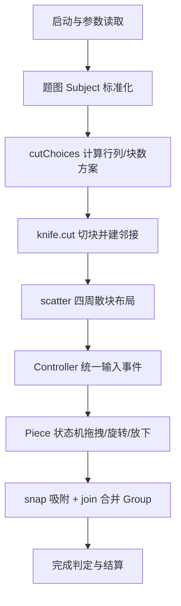
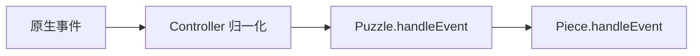
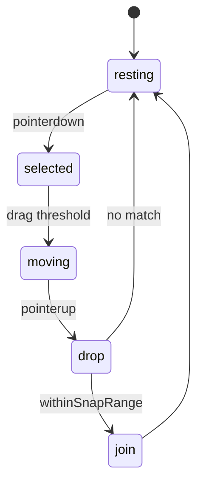

# 从 0 到 1 复刻 `jigex-prog.js` 拼图游戏（新手分阶段教程）

> 目标：不是“看懂一堆压缩代码”，而是用工程化方式，逐步做出**手感与机制都接近原版**的拼图游戏。

---

## 0. 先建立正确心智模型

`jigex-prog.js` 不是单一脚本，而是“拼图运行时（runtime）”。



如果你按这个顺序开发，几乎不会走弯路。

---

## 1. `jigex-prog.js` 的关键逻辑（你要先看懂这 9 层）

### 1.1 启动与模块装配
- 入口先做浏览器兼容（polyfill）、错误监控、参数解析。
- 再创建模块注册器：当依赖满足时逐个初始化模块，最后触发程序启动。

**你该学到的点**：
- 游戏不是“一个类跑到底”，而是“模块 + 生命周期”。

---

### 1.2 参数系统（`parms`）
- 从 URL / data-attributes / profile JSON 合并配置。
- 支持 `url`、`nop`（块数）、`min`、`credit`、调试参数等。

**你该学到的点**：
- 配置读取应集中在一个入口，不要散在各组件里。

---

### 1.3 输入控制中台（Controller）
- 统一 `mouse / touch / pointer / keyboard`。
- 提供 capture/release，让拖拽时输入稳定地交给当前目标。



**你该学到的点**：
- 别让每个拼图块单独监听 DOM 事件；统一入口更稳。

---

### 1.4 题图预处理（Subject）
- 把任意尺寸原图缩放到“适合当前画布”的工作尺寸。
- 输出后续切块用的标准化图像空间。

**你该学到的点**：
- 先标准化坐标系，再谈切块和吸附。

---

### 1.5 总控导演（Puzzle）
- 负责：何时开始准备、何时切块、何时可交互、何时完成。
- 不直接实现“块怎么动”，而是调度 Piece / Group。

---

### 1.6 切块引擎（knife）
- `cutChoices`：按题图比例计算候选行列组合。
- `cut`：生成块、纹理遮罩、邻居关系、边块标记。

**你该学到的点**：
- 原版不是“随便切 N 块”，而是根据图像比例动态匹配 rows/cols。

---

### 1.7 单块状态机（Piece）
- 核心状态：resting / selected / moving / touched ...
- 放下时执行 snap 检测；成功后 join 到组。



---

### 1.8 吸附 + 组装配（snap / join / Group）
- 只和“拓扑邻居”比较（不是全局碰撞）。
- 角度一致 + 位移误差在阈值内才吸附。
- join 后形成 Group，后续整组联动。

**你该学到的点**：
- 拼图手感的本质是“拓扑约束 + 阈值设计”，而不是简单碰撞检测。

---

### 1.9 开局散块布局（scatter）
- 非纯随机：考虑中间题图区、边缘空间、盒面 UI。
- 会做类似螺旋/分区摆放，让开局可玩性更高。

---

## 2. 从 0 到 1 的开发路线（建议 7 个阶段）

> 每阶段都给你：目标、最小功能、完成标准。

### 阶段 A：搭脚手架（1~2 天）
**目标**：能显示画布和一张题图。  
**最小功能**：
1. 建立 `GameRuntime`（或 `PuzzleApp`）主循环。
2. 创建渲染层（Canvas2D 或 WebGL）。
3. 加载图片并居中显示。

**完成标准**：
- 可稳定 resize，坐标不会乱。

---

### 阶段 B：做“矩形切块 MVP”（2~3 天）
**目标**：先别做锯齿边，先能切出 rows*cols 的矩形块。  
**最小功能**：
1. `PieceSpec {id,row,col,homeX,homeY,w,h}`。
2. 从题图裁剪每块纹理。
3. 渲染所有块。

**完成标准**：
- 所有块在“正确位置”时可还原完整图。

---

### 阶段 C：输入中台 + 单块拖拽（2 天）
**目标**：能抓起、拖动、放下一块。  
**最小功能**：
1. Controller 归一化事件。
2. 命中测试（pick top-most piece）。
3. 拖拽时把块提到顶层。

**完成标准**：
- 鼠标和触摸都能拖。

---

### 阶段 D：吸附（snap）与邻接关系（2~3 天）
**目标**：接近原版“放手自动吸附”的核心手感。  
**最小功能**：
1. 为每块建立 `neighbors = {top,right,bottom,left}`。
2. `measureGap(piece, neighbor)` 计算理论差和当前差。
3. 阈值命中则自动对齐到理论位置。

**完成标准**：
- 相邻块靠近时能吸附，非邻居不吸。

---

### 阶段 E：Group 合并与整组移动（2~4 天）
**目标**：拼上后变成一个整体。  
**最小功能**：
1. `Group {members}`。
2. join 时把两组并成一组。
3. 拖任意成员时，整组联动。

**完成标准**：
- 多块组合后行为稳定，不抖动、不穿透。

---

### 阶段 F：开局散块（scatter）与玩法细节（2~3 天）
**目标**：体验从“能玩”提升到“好玩”。  
**最小功能**：
1. 中间保留题图区。
2. 块优先散布在四周。
3. 避免明显重叠（网格占位或简单碰撞回退）。

**完成标准**：
- 开局不会全堆一坨，玩家可直接上手。

---

### 阶段 G：打磨到“像原版”（持续）
**建议顺序**：
1. 旋转模式（0/90/180/270）。
2. 边块筛选（show edges only）。
3. 自动保存/恢复。
4. 完成动画与计时统计。

---

## 3. 你可以直接照抄的项目结构（新手友好）

```text
src/
  core/
    runtime.ts
    controller.ts
    puzzle.ts
  model/
    piece.ts
    group.ts
    subject.ts
  engine/
    cutter.ts
    snap.ts
    scatter.ts
  render/
    canvas_renderer.ts
  ui/
    hud.ts
```

---

## 4. 三个关键算法（最小可用版）

### 4.1 邻居吸附判定（伪代码）

```ts
function neighborWithinSnapRange(piece: Piece): Piece | null {
  for (const n of piece.neighbors) {
    if (!n) continue
    if (piece.rotation !== n.rotation) continue

    const idealDx = n.homeX - piece.homeX
    const idealDy = n.homeY - piece.homeY
    const currDx = n.x - piece.x
    const currDy = n.y - piece.y

    const err = Math.hypot(currDx - idealDx, currDy - idealDy)
    if (err < SNAP_THRESHOLD) return n
  }
  return null
}
```

---

### 4.2 组装合并（伪代码）

```ts
function join(a: Piece, b: Piece) {
  const ga = a.group ?? createGroup(a)
  const gb = b.group ?? createGroup(b)
  if (ga === gb) return

  // 把 gb 全成员坐标按参考块对齐后并入 ga
  alignGroupToNeighbor(ga, gb, a, b)
  for (const m of gb.members) ga.add(m)
  destroyGroup(gb)
}
```

---

### 4.3 开局散块（伪代码）

```ts
function scatter(pieces: Piece[], board: Rect, reservedCenter: Rect) {
  const slots = buildSlotsAroundReservedArea(board, reservedCenter)
  shuffle(slots)
  for (let i = 0; i < pieces.length; i++) {
    pieces[i].x = slots[i].x
    pieces[i].y = slots[i].y
  }
}
```

---

## 5. 新手最容易踩的 8 个坑

1. **把吸附写成“碰到就吸”**：应只检查拓扑邻居。  
2. **没有组（Group）概念**：后期会非常难维护。  
3. **输入事件散在组件里**：触摸/鼠标会互相打架。  
4. **缩放后坐标系混乱**：必须统一世界坐标。  
5. **每帧全量碰撞检测**：性能会崩。  
6. **拖拽不抬层级**：看起来像“拿不起来”。  
7. **散块完全随机**：开局经常不可玩。  
8. **没有状态机**：Bug 很快指数增长。

---

## 6. 30 天学习-开发计划（非常适合新手）

- **第 1 周**：A+B（能切块并正确渲染）
- **第 2 周**：C+D（能拖拽并吸附）
- **第 3 周**：E+F（能组装并有好开局）
- **第 4 周**：G（旋转、存档、完成体验）

每天固定节奏：
1. 先实现最小功能。
2. 录屏验证交互。
3. 写 3 条回归用例（拖拽、吸附、合并）。

---

## 7. 你下一步该做什么（今天就能开工）

1. 先做“矩形块 + 拖拽 + 邻居吸附”的 MVP。  
2. 只要这 3 点跑通，你就已经完成 70% 核心玩法。  
3. 再上 Group 合并与 scatter，游戏就会非常接近 `jigex-prog.js` 的体验。

如果你愿意，我下一步可以继续给你：
- 一个**可直接运行的最小项目模板**（HTML + JS），
- 并按“每天一个小目标”带你把第 1 周做完。
