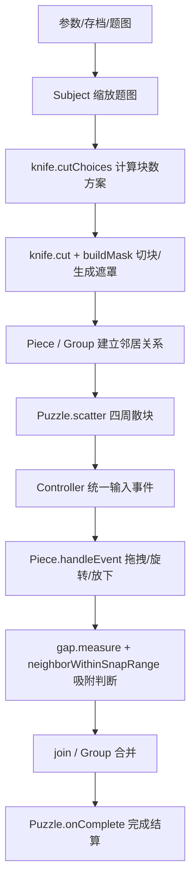
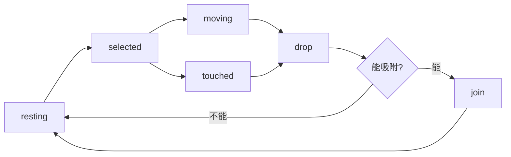

这份 [jigex-prog.js](D:/code/jigsaw_world_layout/jigex-prog.js) 本质上不是“一个拼图脚本”，而是一个完整的拼图运行时。  
如果按功能拆开，它的核心可以分成 9 层。

**总览**

---

**1. 状态与常量层**
入口在 [jigex-prog.js:1512](D:/code/jigsaw_world_layout/jigex-prog.js:1512)

这里定义了整套状态机：

- `PS_DEAD / INIT_PREPPING / PREPPING / WAITING / READY / PLAYING`
- `Piece` 的状态：`resting / selected / moving / touched / captured / remote-select / remote-control`
- 捕获模式状态：`off / ready / capturing / releasing`
- 图层层级：背景层、底层、primer 层、拼图层、顶层

这一层的作用：
- 让整局游戏有明确阶段
- 让单块拼图有明确交互状态
- 让 UI、输入、拼图块渲染共用同一套状态语义

你可以把它理解成“全游戏的交通灯系统”。

---

**2. 输入控制层 `Controller`**
入口在 [jigex-prog.js:1537](D:/code/jigsaw_world_layout/jigex-prog.js:1537)

核心职责：
- 统一 `mouse / touch / pointer / keyboard`
- 管理事件捕获 `capture / release`
- 把事件分发给当前操作者或监听器
- 处理一些快捷键逻辑，比如旋转、切换模式、调试键

关键点：
- `_.mouseController`
- `_.touchController`
- `_.pointerController`
- `handleEvent` 里把浏览器原始事件转成内部事件流

这层的意义很大：
- 上层的 `Puzzle` 和 `Piece` 不需要分别处理三套输入
- 所有拖拽、触摸、滚轮旋转都走同一条逻辑管道

一句话：它是拼图游戏的“输入中台”。

---

**3. 题图层 `Subject`**
入口在 [jigex-prog.js:1685](D:/code/jigsaw_world_layout/jigex-prog.js:1685)

核心职责：
- 保存原始图片
- 计算适合当前画布的缩放比例
- 把图片绘制到内部 canvas
- 生成贴图纹理给后面的切块和渲染使用

关键逻辑在 [jigex-prog.js:1689](D:/code/jigsaw_world_layout/jigex-prog.js:1689)：
- 如果题图太大，就持续缩小
- 如果题图太小，就持续放大
- 目标是让题图面积大约占画布的合理比例，并且不超过边界

这层解决的问题是：
- 不同尺寸的原图都能落到统一的游戏空间里
- 后面 `knife.cut` 才能基于“已经标准化”的题图尺寸工作

---

**4. 游戏总控层 `Puzzle`**
构造和主流程在 [jigex-prog.js:1837](D:/code/jigsaw_world_layout/jigex-prog.js:1837)  
准备流程在 [jigex-prog.js:1726](D:/code/jigsaw_world_layout/jigex-prog.js:1726) 和 [jigex-prog.js:1742](D:/code/jigsaw_world_layout/jigex-prog.js:1742)

`Puzzle` 是整局的导演，主要做 6 件事：

- 读取 URL 参数、存档、多人局信息
- 创建当前 puzzle 实例
- 等待 `subject ready + boxTop ready + UI ready`
- 调用 `knife.cut` 真正生成碎片
- 绑定控制器事件
- 负责完成判定、记录更新、资源释放

你最该关注的几个方法：

- `Ht()`：是否已经满足“可以开始准备”的条件
- `Wt()`：真正执行准备流程
- `handleEvent()`：把输入事件转发给拼图块或盒面
- `scatter()`：开局或局部重新布局
- `showEdgesOnly()`：边块模式
- `onComplete()`：完成结算

可以把 `Puzzle` 理解成：
- 不负责“单块怎么动”
- 只负责“这一局何时开始、何时结束、何时切块、何时结算”

---

**5. 碎片集合层 `pieces`**
核心在 [jigex-prog.js:1704](D:/code/jigsaw_world_layout/jigex-prog.js:1704)

这是一个“拼图块集合管理器”，主要提供：

- `getPieceAt()`：根据坐标找到当前点中的拼图块
- `getPiece(id)`：按 id 获取块
- `dispose()`：清理所有块
- `isEdgeComplete`：边框是否已经完整拼好
- `length / numRows / numCols / numEdges`：整体统计信息

这层并不是某一块，而是“所有块的容器”。

它的价值在于：
- `Puzzle` 不必直接扫描所有块
- 可以快速知道边框是否完成
- 可以快速从鼠标位置找到被点击的那一块

---

**6. 单块行为层 `Piece`**
入口在 [jigex-prog.js:2004](D:/code/jigsaw_world_layout/jigex-prog.js:2004)  
事件状态机在 [jigex-prog.js:2052](D:/code/jigsaw_world_layout/jigex-prog.js:2052)

这是单块拼图最核心的一层。

每个 `Piece` 管这些数据：
- 自己的位置
- 角度
- 状态
- 邻居
- 所属 group
- 是否移动过
- 是否边块

最关键的方法：

- `handleEvent()`：拖拽、触摸、旋转、放下
- `move()`：移动自己或整组
- `rotate()` / `rotateTo()`：旋转自己或整组
- `drop()`：放手时判断是否吸附
- `capture()` / `release()`：捕获模式相关
- `raise()`：提到顶层

`handleEvent()` 的本质是一个交互状态机：

新手最该精读的就是这一段，因为它决定了“用户拖一块时到底发生什么”。

---

**7. 吸附与分组层 `gap / snap / join / Group`**
关键位置：
- `gap.measure` 在 [jigex-prog.js:2105](D:/code/jigsaw_world_layout/jigex-prog.js:2105)
- `neighborWithinSnapRange` 在 [jigex-prog.js:2116](D:/code/jigsaw_world_layout/jigex-prog.js:2116)
- `join` 在 [jigex-prog.js:2125](D:/code/jigsaw_world_layout/jigex-prog.js:2125)
- `Group` 在 [jigex-prog.js:2180](D:/code/jigsaw_world_layout/jigex-prog.js:2180)

这是整份代码的“玩法灵魂”。

**`gap.measure` 做什么**
- 不是看两块有没有碰撞
- 而是计算“这两块在正确拼接时应该相差多少位移”

也就是：
- 正确坐标差是多少
- 当前坐标差是多少
- 两者误差是否足够小

**`neighborWithinSnapRange` 做什么**
- 只检查自己的邻居
- 角度一致才继续
- 如果当前位置与理论位置足够接近，就返回可吸附邻居

**`join` 做什么**
- 两块拼上时，不是简单贴住
- 而是合并成一个 `Group`
- 之后拖任意一块，整组一起动

**`Group` 做什么**
- 保存成员
- 统一位置关系
- 维护边块计数
- 负责组与组的合并

一句话总结这一层：
它实现的不是“碰上就连”，而是“按正确拓扑关系吸附并形成装配体”。

---

**8. 布局层 `scatter`**
入口在 [jigex-prog.js:1946](D:/code/jigsaw_world_layout/jigex-prog.js:1946)

这段非常重要，因为它解释了为什么原版开局看起来那么自然。

它不是简单随机，而是：

- 先估算平均块宽高
- 算出画布能容纳多少列多少行
- 预留中间题图区
- 考虑盒面预览是否显示
- 用螺旋式路径从四周摆放碎片
- 避免碎片互相压住
- 支持局部重排、边块模式重排、只重排未移动块

这就是为什么原版体验像“被设计过”，而不是“随机扔一地”。

---

**9. 切块与渲染准备层 `knife`**
关键位置：
- `buildMask` 在 [jigex-prog.js:2266](D:/code/jigsaw_world_layout/jigex-prog.js:2266)
- `cutChoices` 在 [jigex-prog.js:2352](D:/code/jigsaw_world_layout/jigex-prog.js:2352)
- `cut` 在 [jigex-prog.js:2361](D:/code/jigsaw_world_layout/jigex-prog.js:2361)

这是整份代码最“像引擎”的部分。

**`cutChoices()`**
作用：
- 根据题图宽高
- 反复尝试不同 `rows / cols / size`
- 生成一组可选的块数方案

它并不是写死“100 块、200 块”，而是根据当前图像动态算。

**`cut()`**
作用：
- 根据最终选定的 `rows / cols / size`
- 生成每块的基础 spec
- 决定光照等级、阴影深度
- 初始化 shader
- 调用 `buildMask`
- 创建所有 `Piece`
- 建立上下左右邻居和对角邻居
- 标记边块
- 最后触发 `scatter()`

**`buildMask()`**
这是最难但也最值钱的部分，它做了三件事：

- 为每条边决定是平边、凸 tab 还是凹 hole
- 用曲线模板把每块外轮廓画出来
- 从图像像素中反推出遮罩、边缘、阴影、高光数据

最终每块会拿到：
- `mask`
- `mask2`
- 边缘编码
- 阴影/高光信息

这些不是为了逻辑，而是为了渲染时看起来像真实拼图块。

---

**10. 完成与计时层**
关键位置：
- `percentComplete` 在 [jigex-prog.js:1921](D:/code/jigsaw_world_layout/jigex-prog.js:1921) 左右
- `onComplete` 在 [jigex-prog.js:1925](D:/code/jigsaw_world_layout/jigex-prog.js:1925)
- `clock` 在 [jigex-prog.js:2403](D:/code/jigsaw_world_layout/jigex-prog.js:2403)

职责：
- 统计进度
- 停止计时
- 更新存档
- 更新完成次数
- 播放 applause 音效
- 多人局同步计时信息

注意：
它的完成判定不是逐像素对整图比对，而是看组装关系是否已经覆盖全部拼图块。

---

**11. 非核心但很大的一层：多人/存档/UI**
你在文件里还会看到很多逻辑不是单机拼图核心，但也占了很大体积：

- 多人联机同步
- 记录恢复
- 广告控制
- 盒面预览 `boxTop`
- 菜单与按钮状态
- 调试和错误上报

如果你的目标是“读懂拼图玩法”，这些先放后面：
- 联机事件同步
- 广告
- 存档上传下载
- 调试日志和故障上报

---

**按功能拆解后的建议阅读顺序**
最推荐这样读：

1. `Puzzle` 状态与入口  
看 [jigex-prog.js:1512](D:/code/jigsaw_world_layout/jigex-prog.js:1512) 和 [jigex-prog.js:1837](D:/code/jigsaw_world_layout/jigex-prog.js:1837)

2. `Subject` 与准备流程  
看 [jigex-prog.js:1685](D:/code/jigsaw_world_layout/jigex-prog.js:1685)、[jigex-prog.js:1726](D:/code/jigsaw_world_layout/jigex-prog.js:1726)、[jigex-prog.js:1742](D:/code/jigsaw_world_layout/jigex-prog.js:1742)

3. `Piece.handleEvent`  
看 [jigex-prog.js:2052](D:/code/jigsaw_world_layout/jigex-prog.js:2052)

4. 吸附公式  
看 [jigex-prog.js:2105](D:/code/jigsaw_world_layout/jigex-prog.js:2105) 和 [jigex-prog.js:2116](D:/code/jigsaw_world_layout/jigex-prog.js:2116)

5. 分组逻辑  
看 [jigex-prog.js:2125](D:/code/jigsaw_world_layout/jigex-prog.js:2125) 和 [jigex-prog.js:2180](D:/code/jigsaw_world_layout/jigex-prog.js:2180)

6. 开局散块  
看 [jigex-prog.js:1946](D:/code/jigsaw_world_layout/jigex-prog.js:1946)

7. 切块系统  
看 [jigex-prog.js:2266](D:/code/jigsaw_world_layout/jigex-prog.js:2266)、[jigex-prog.js:2352](D:/code/jigsaw_world_layout/jigex-prog.js:2352)、[jigex-prog.js:2361](D:/code/jigsaw_world_layout/jigex-prog.js:2361)

---

**一句话总结**
如果把这份代码压成三句话：

- `Puzzle` 决定“这局怎么开始、怎么运行、怎么结束”
- `Piece + Group` 决定“单块怎么拖、怎么吸附、怎么变成装配体”
- `knife` 决定“原图怎么被加工成可拼、可渲染、可吸附的异形块”

如果你愿意，我下一步可以继续帮你做两种更深入的拆法：

1. 把这份代码整理成一张“功能模块表”，列出每个模块的职责、输入、输出、关键函数  
2. 把 `Puzzle / Piece / knife` 三部分分别改写成更容易读的中文伪代码版本